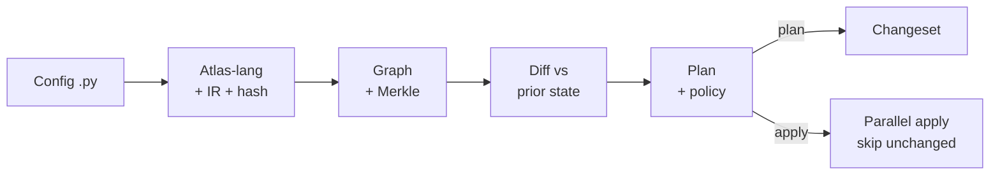

# Atlantide

Typed, deterministic Infrastructure-as-Code for Python.

Atlantide is an IaC engine built on three principles:

- **Enforced determinism.** Configs are written in plain Python but executed by
  Atlas-lang, a bounded interpreter with no access to the clock, randomness, the
  environment, or the network. Two runs of the same config produce a
  byte-identical intermediate representation and a stable content hash.
- **Graph state with Merkle skip.** Resources form a dependency graph. A two-phase
  Merkle `input_hash` lets `apply` skip unchanged nodes with zero provider calls,
  and independent nodes reconcile in parallel.
- **Typed resources with per-field mutability.** Each field is declared
  `mutable()`, `immutable()`, or `computed()`. Changing a mutable field is an
  in-place UPDATE; changing an immutable one is a REPLACE (destroy then create);
  computed fields never diff.

## Install

Requires Python ≥ 3.11. Uses [uv](https://docs.astral.sh/uv/).

```bash
uv sync
```

## Quickstart

Configs are written in plain Python, type-checked by an IDE and `mypy`, and executed by Atlas-lang:

```python
from atlantide.core import Stack, output
from atlantide.providers.aws import S3Bucket, SqsQueue

for env in ["dev", "prod"]:
    with Stack(env, region="eu-north-1", name_prefix="atlantide", tags={"env": env}):
        assets = S3Bucket("assets", versioning=(env == "prod"))
        jobs = SqsQueue("jobs", fifo=True)
        output("assets_arn", assets.arn)
```

Reading another resource's output (`assets.arn`) returns a lazy `Ref`, which wires
the dependency and resolves to the real value at apply time.

### Authoring helpers

- **Output combinators.** `concat`, `interpolate`, and `join` build a value from an
  apply-time `Ref` before it is known. The language is not re-run at apply, so they
  serialize as data rather than closures:

  ```python
  S3BucketPolicy("p", bucket=assets.bucket, statements=[
      allow("s3:GetObject", on=concat(assets.arn, "/*"), principal="*"),
  ])
  ```
- **Rename without replace.** Assigning a renamed resource its old id (or bare old
  name) maps it to the existing state node instead of a destroy-and-create:

  ```python
  S3Bucket("assets_v2", lifecycle=Lifecycle(aliases=("assets",)), ...)
  ```
- **Per-block region.** `with region("us-east-1"):` overrides the stack's region
  for the resources inside it, such as an ACM certificate for CloudFront.
- **Components.** Library-authored L2 groups such as `aws.SecureBucket` bundle
  several resources behind one parameterized object; children auto-namespace so a
  component used twice never collides. Components can also be published in a git
  repository and imported by any project. See [Components](#components).

## CLI

```bash
uv run atlantide plan    infra.py                    # preview changes
uv run atlantide apply   infra.py                    # reconcile (parallel)
uv run atlantide apply   infra.py                    # re-run: all NOOP, zero provider calls
uv run atlantide refresh                             # detect drift vs live state
uv run atlantide graph   infra.py --format mermaid   # dependency graph
uv run atlantide destroy                             # tear down
```

State defaults to `atlantide.db`; override with `--state`. Mutating commands
(`apply` / `deploy` / `destroy` / `refresh`) take `--confirm/-y`, `--region`,
`--parallelism/-p`, and — where they change state — `--on-failure rollback|halt`
(**default `rollback`**: undo completed nodes on failure). `plan` and `refresh`
support `--json` and `--detailed-exitcode` (0 = no change, 2 = changes, 1 = error).

Config path, state db, and defaults can be fixed once in `atlantide.toml` so
commands take no flags inside a project:

```toml
config      = "infra.py"
state       = "atlantide.db"
parallelism = 8
aws_region  = "eu-north-1"
aws_profile = "default"
aws_endpoint = "http://localhost:4566"   # e.g. LocalStack
secrets_key   = ".atlantide.key"
secrets_store = ".atlantide.secrets"

[aws.aliases.prod]                       # alternate account (multi-account)
profile  = "prod-account"                # a resource selects it via provider_alias="prod"
endpoint = "http://localhost:4566"
```

Additional commands:

- **`build` / `verify` / `deploy`** — portable `.atlas` artifacts (content-hashed,
  provider-version pinned): compile once, promote the same bytes anywhere.
- **`refresh`** — read live provider state, report drift; `--write` syncs it back.
- **`secret`** — manage the local AES-GCM encrypted name→value store; resources
  reference secrets by name (`SecretRef`), resolved at apply:

  ```bash
  uv run atlantide secret set app/signing-key       # value prompted (hidden) if omitted
  uv run atlantide secret get app/signing-key -r    # print plaintext (--reveal required)
  uv run atlantide secret list                       # names only, no values
  uv run atlantide secret rm  app/signing-key        # remove
  ```
- **`component`** — `add` / `lock` / `vendor` / `verify` components published in
  public git repos; imported as `atlantide.components.<alias>`. See
  [Components](#components).
- **`resources` / `schema`** — discover resource types and inspect a type's fields.

## Components

L2 constructs group several resources behind one parameterized object, comparable
to Pulumi's `ComponentResource` or a CDK Construct. Config uses components but
cannot define them: Atlas-lang bans `class`, so a component is ordinary Python
written by a library or provider author.

```python
from atlantide.core import Component, child
from atlantide.providers.aws import S3Bucket

class SecureBucket(Component):
    def __init__(self, name, *, bucket):
        self.bucket = child(S3Bucket, "assets", bucket=bucket)
        # ...plus a TLS-only hardening policy wired to self.bucket
```

A component owns no IR node of its own — its children lower as normal flat
resources, and each child's logical name is namespaced under the instance
(`{component}-{child}`), so instantiating a component twice never collides.

### Publishing & consuming

Components can be shared in a public git repository and imported by any project.
There is no live URL import: config is a deterministic sandbox that may import only
`atlantide.*` and cannot access the network, so a fetch at eval time would violate
both constraints. Instead a component is fetched once, pinned to a commit and
content hash (following the `terraform init` model), and the vendored code is
imported locally under the `atlantide.components.*` namespace, which the sandbox
permits.

```bash
# fetch, pin (commit + content hash) into atlantide.lock, vendor into .atlantis/
uv run atlantide component add https://github.com/acme/secure-bucket --ref v1.2.0 --as acme --subdir src
uv run atlantide component verify   # re-hash vendored trees vs the lock (tamper/drift)
uv run atlantide component vendor    # rebuild .atlantis/ from the lock alone (e.g. fresh checkout)
uv run atlantide component lock      # re-resolve declared refs -> commits
```

```python
# infra.py — imported and used like any other resource
from atlantide.components.acme import SecureBucket
SecureBucket("assets", bucket="acme-assets")
```

`add` records the source under `[components.acme]` in `atlantide.toml` and the
resolved pin in `atlantide.lock`. **Commit `atlantide.lock`; git-ignore `.atlantis/`**
(it's derived — `vendor` rebuilds it from the lock). A `build` artifact also records
each component's commit as provenance.

**Trust.** A published component runs as trusted Python, like a provider, and
should be reviewed before it is added. Thereafter integrity rests on the pin, and
`verify` fails on any tamper or drift. See
[`examples/components/`](examples/components/) for a runnable publish-and-consume
walkthrough.

## How it works

Every `plan`/`apply` runs the same pipeline — pure, deterministic stages first,
then the effectful reconcile:



**Steps**

1. **Atlas-lang** — the config is validated (Python subset — no `while`, `class`,
   dunder, `eval`, or non-allowlisted imports) and evaluated by a fuel-bounded
   interpreter with deterministic builtins only.
2. **Registry → IR** — evaluated resources, `Ref`s, and `output()`s lower into an
   IR graph; `Ref`s become dependency edges.
3. **Canonicalize** — IR serializes to canonical JSON (RFC 8785) and gets a stable
   content hash; two runs are byte-identical.
4. **Graph** — the dependency graph is built and checked for cycles (Tarjan).
5. **Merkle** — each node gets a two-phase `input_hash` in topological order.
6. **Diff** — desired hashes compare against prior state → per-node action
   (NOOP / CREATE / UPDATE / REPLACE / DELETE); per-field mutability decides
   UPDATE vs REPLACE.
7. **Plan** — actions ordered (creates/updates topo, deletes reversed; REPLACE =
   destroy-before-create); `prevent_destroy` blocks protected deletes.
8. **Policy** — plan-time bindings evaluate against the changeset; mandatory
   violations block `apply`.
9. **Apply** — under a whole-state lock, the executor reconciles independent nodes
   in parallel, calls providers, skips Merkle-unchanged nodes (zero calls), and
   persists incrementally. On failure it rolls back completed nodes as a saga by
   default (`--on-failure halt` instead leaves state as-is, resumable). Outputs print.

## Providers

- **`local`** — `File`, `Null`. Credential-free; runs in CI.
- **`random`** — `Uuid`, `Password`, `Id`, `Timestamp`. Values generated once at
  apply, then pinned in state.
- **`aws`** — `S3Bucket`, `S3BucketPolicy`, `SqsQueue`, `IamRole`, `IamPolicy`,
  `LambdaFunction`, `SnsTopic`, `SnsSubscription`, `DynamoDbTable`,
  `CloudWatchLogGroup`, `Vpc`, `Subnet`, `SecurityGroup`. Plus IAM policy helpers
  (`allow`, `deny`, `assume_role`, `ServicePrincipal`) and the `SecureBucket` L2
  component. Any resource may set `provider_alias=` to target an alternate
  account. LocalStack-friendly via `--region` / `aws_endpoint`.

## Architecture

Layered, with import boundaries enforced by [import-linter](https://import-linter.readthedocs.io/):

| Layer | Responsibility |
|---|---|
| `core/` | `Resource`, field helpers, `Output`/`Ref`, `Provider` ABC, registry, `Stack` |
| `lang/` | Atlas-lang: subset validator, fuel-bounded interpreter, deterministic builtins |
| `ir/` | IR model, lowering (Ref → edges), canonical JSON (RFC 8785), content hash, two-phase Merkle, `.atlas` artifacts |
| `graph/` | Graph build, Tarjan cycle detection, async Kahn scheduler |
| `state/` | `StateBackend` ABC — sqlite (default) + memory; whole-state lock |
| `reconcile/` | Diff (Merkle NOOP-skip), planner, parallel executor (saga rollback / resume), refresh |
| `policy/` | Modular per-resource policy engine (`@policy` / `enforce`; mandatory blocks, advisory warns) |
| `secrets/` | `SecretsProvider` ABC — env + AES-GCM keyfile store; secrets referenced by name, resolved at apply |
| `engine/` | `Engine` — orchestrates compile → plan → apply/destroy/refresh/build/deploy; owns the state lock |
| `providers/` | Provider implementations (local, random, aws) |
| `components/` | Published components: git fetch, `atlantide.lock` pinning, vendored-tree hashing, and the import mount |
| `cli/` | Typer app; console/render/json/diagram/progress output, project config |

## Examples

- [`examples/aws/`](examples/aws/) — a per-environment stack of ~14 resources each,
  wiring cross-resource and cross-provider dependencies automatically.
- [`examples/components/`](examples/components/) — authoring a publishable component
  and consuming it from another project (git-pinned, vendored).

## Development

```bash
uv sync --extra dev
uv run pytest            # tests (memory + sqlite backends), 90% coverage floor
uv run mypy              # strict type check
uv run ruff check
uv run lint-imports      # architecture contracts
```
