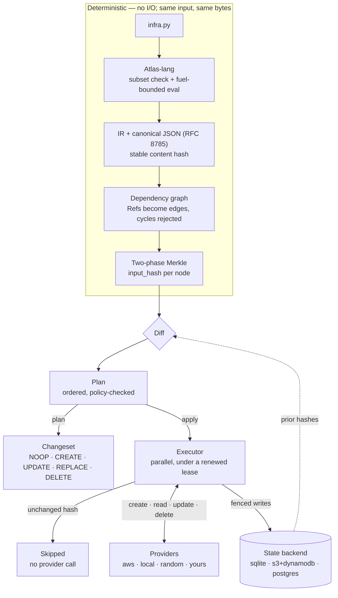

# Atlantide

**Typed, deterministic Infrastructure-as-Code for Python.**

Write infrastructure in real Python — type-checked by your IDE and `mypy`, not a
templating language — and get the guarantees a config language exists to provide:
the same config always produces the same plan, and the engine can prove it.

Atlantide rests on three ideas:

- **Enforced determinism.** Configs are plain Python, but executed by *Atlas-lang*:
  a bounded interpreter with no clock, no randomness, no environment, no network.
  Two runs of the same config produce a byte-identical intermediate representation
  and a stable content hash. Not a convention — the interpreter cannot do otherwise.
- **Graph state with Merkle skip.** Resources form a dependency graph. A two-phase
  Merkle `input_hash` lets `apply` skip unchanged nodes with *zero* provider calls,
  and reconcile independent nodes in parallel.
- **Per-field mutability.** Every field is declared `mutable()`, `immutable()`, or
  `computed()`. Changing a mutable field is an in-place UPDATE; changing an
  immutable one is a REPLACE; computed fields never diff. What a change costs is
  visible in the type, before you run anything.

---

## Install

```bash
pip install atlantide          # or: uv add atlantide
```

Python ≥ 3.11.

```bash
atlantide init myproject       # scaffold a project that already compiles
cd myproject && atlantide plan
```

`init` writes an `atlantide.toml`, a starter config, and a `.gitignore` that keeps
the state database and the secrets keyfile out of git. The default template uses the
local provider, so it applies with no cloud credentials at all.

## A quick look

```python
from atlantide.core import Config, EnvSchema, Stack, output
from atlantide.policy import enforce
from atlantide.providers.aws import S3Bucket, SqsQueue

enforce("require-tags", keys=["env"])
enforce("deny-destroy-in-protected", stacks=["prod"])

class AppEnv(EnvSchema):
    versioning: bool = False

config = Config(
    AppEnv,
    envs={
        "dev":  {"region": "eu-north-1", "tags": {"env": "dev"}},
        "prod": {"region": "eu-north-1", "tags": {"env": "prod"}, "versioning": True},
    },
)

for env in config.envs():                       # env: AppEnv
    with Stack(env.name, config=env, name_prefix="atlantide"):
        assets = S3Bucket("assets", versioning=env.versioning)
        jobs = SqsQueue("jobs", fifo=True)
        output("assets_arn", assets.arn)
```

One `Config` holds every environment and what differs between them. Each variable
declares its type and, optionally, a default, so a missing or mistyped prod value
fails `atlantide validate` rather than the prod apply. `region`, `tags` and
`name_prefix` are well-known keys the `Stack` reads directly.

An `EnvSchema` is the one class Atlas-lang admits — annotated fields only, no
methods and no decorators, so it is still data. Declaring it makes the variables
ordinary attributes: your editor completes `env.versioning`, and
`env.versionning` is a type error. A schema can also be a mapping of `var()`
declarations (`Config(schema={"versioning": var(bool, default=False)},
envs=...)`) when the static side does not matter.

```bash
atlantide plan  infra.py               # preview, every environment
atlantide apply infra.py               # reconcile, in parallel
atlantide apply infra.py               # again: all NOOP, zero provider calls
atlantide apply infra.py --env prod    # prod only; dev is not diffed or touched
```

Reading another resource's output (`assets.arn`) returns a lazy `Ref`. That is what
wires the dependency edge — no explicit `depends_on`, no string addresses — and it
resolves to the real value at apply time.

### Infrastructure that already exists

Declare it as above, then bind it to what is already running rather than building a
second copy:

```bash
atlantide import                              # what is declared but not tracked
atlantide import prod:aws.S3Bucket:assets     # found by name
atlantide import prod:aws.Vpc:main vpc-0abc   # located by an id AWS assigned
atlantide plan                                # no changes
```

A resource whose live settings differ from what the config declares is *not*
imported — importing it would mean the next apply quietly changes it. `import` prints
what differs so the config can be reconciled first, or `--allow-drift` adopts it and
lets the next plan show the update. Nothing about `import` creates, changes or
deletes anything; the undo is `atlantide state rm`, which forgets a row and leaves
the resource alone.

## How it works

Every `plan` and `apply` runs one pipeline. Everything before the diff is pure and
deterministic; everything after it touches the world.


```mermaid
flowchart TB
    subgraph pure["Deterministic — no I/O; same input, same bytes"]
        direction LR
        cfg["infra.py"] --> lang["Atlas-lang<br/>subset check + fuel-bounded eval"]
        lang --> ir["IR + canonical JSON (RFC 8785)<br/>stable content hash"]
        ir --> dag["Dependency graph<br/>Refs become edges, cycles rejected"]
        dag --> merkle["Two-phase Merkle<br/>input_hash per node"]
    end

    merkle --> diff{"Diff"}
    store[("State backend<br/>sqlite · s3+dynamodb · postgres")] -.->|prior hashes| diff
    diff --> plan["Plan<br/>ordered, policy-checked"]

    plan -->|plan| changeset["Changeset<br/>NOOP · CREATE · UPDATE · REPLACE · DELETE"]
    plan -->|apply| exec["Executor<br/>parallel, under a renewed lease"]

    exec -->|unchanged hash| skip["Skipped<br/>no provider call"]
    exec <-->|create · read · update · delete| prov["Providers<br/>aws · local · random · yours"]
    exec -->|fenced writes| store
```

1. **Atlas-lang** validates the config against a Python subset — no `while`,
   `class`, dunder access, `eval`, or non-allowlisted imports — then evaluates it
   with a fuel budget and deterministic builtins only.
2. **Lowering** turns evaluated resources, `Ref`s and `output()`s into an IR graph.
   `Ref`s become dependency edges.
3. **Canonicalization** serializes that IR to RFC 8785 JSON and hashes it. Two runs
   are byte-identical, which is what makes a `.atlas` artifact portable.
4. **Graph + Merkle**: cycles are rejected (Tarjan), then each node gets a
   two-phase `input_hash` in topological order — so a change to one resource
   propagates to everything downstream of it, and nothing else.
5. **Diff** compares desired hashes against prior state, yielding a per-node action.
   Per-field mutability is what decides UPDATE versus REPLACE.
6. **Plan** orders the actions (creates and updates topologically, deletes in
   reverse; a REPLACE is destroy-before-create), then policy bindings run against
   the changeset — a mandatory violation blocks `apply` before anything happens.
7. **Apply** takes a lease over the reachable graph, reconciles independent nodes
   in parallel, skips Merkle-unchanged nodes entirely, and persists incrementally.
   On failure it rolls back completed nodes as a saga.

The pure half is why `plan` needs no credentials, why `validate` runs in a
pre-commit hook, and why the same compiled artifact can be promoted from staging
to production without re-executing the config.

## Main features

**Determinism**
- No clock, environment, or network in config — the interpreter has no such builtins.
- Content-hashed IR; `build` emits a portable `.atlas` artifact with provider
  versions pinned, `verify` re-checks it.
- Determinism is over *(config, inputs, selected environments)* — only inputs the
  config actually **read**.

**Plans**
- Unchanged nodes cost zero provider calls.
- `apply` re-diffs under the lock and **refuses** if the executed set differs from
  the approved one (`--allow-plan-drift` opts out).
- `refresh` reports which fields it actually checked; an unchecked field is never
  claimed in sync.
- A resource the provider cannot find is reported but **kept**.

**State**
- Backends: sqlite (default), memory, S3 + DynamoDB, Postgres.
- Per-node leases, renewed for as long as a run lives.
- **Fenced writes** — the store refuses a write from a lease that is no longer the
  holder.
- Versioned schema, forward migration, refuse-newer. `state backup` / `restore`.
- Ctrl-C rolls back rather than abandoning the run mid-graph.

**Secrets**
- `atlantide.secret("name")` is a *handle*; plaintext resolves in memory at apply.
- Sensitive outputs sealed at rest; logs and audit records redact by construction.
- Value stores: AES-GCM keyfile, environment, SSM Parameter Store.

**Escape hatches**
- `--target` narrows to a resource and its closure, `--replace` forces a recreate —
  both printed in the plan.
- `--env` narrows to one environment of the config's `Config`. An unselected
  environment is out of scope, not undeclared: its state is never planned for
  deletion, and the plan says which environments it left out.
- A targeted apply leaves unselected state byte-identical.
- `state rm` forgets a row without touching the provider; `state unlock` breaks a
  dead run's lease.

**CI**
- `--json`: stdout is exactly one JSON document, success or failure.
- `--detailed-exitcode`: 0 no changes, 2 changes pending, 1 error.
- `--audit-log` appends every run to JSONL, no-ops included.
- Prompts are refused without a terminal; pass `--confirm/-y`.

**Extensibility**
- Providers are ordinary Python packages discovered by entry point — the built-ins
  included.
- Components (L2 constructs) publishable from a git repo, pinned to a commit and
  content hash, vendored locally.

<!-- docs:start -->
## Documentation

**<https://atlantide-org.github.io/>**

- [CLI](https://atlantide-org.github.io/reference/cli/) — every command, targeting, exit codes
- [Configuration](https://atlantide-org.github.io/reference/configuration/) — `atlantide.toml`, inputs, profiles
- [Remote state](https://atlantide-org.github.io/reference/remote-state/) — S3 and Postgres backends, concurrency, secrets
- [Authoring](https://atlantide-org.github.io/reference/authoring/) — output combinators, explicit ordering, renames
- [Providers](https://atlantide-org.github.io/reference/providers/) — what ships, and writing your own
- [Components](https://atlantide-org.github.io/reference/components/) — L2 constructs, publishing, consuming
- [API reference](https://atlantide-org.github.io/api/) — `atlantide.core` and `atlantide.engine`
- [Architecture](https://atlantide-org.github.io/architecture/) — what each package is for

Runnable examples: [`examples/aws/`](examples/aws/) and [`examples/components/`](examples/components/).
<!-- docs:end -->
