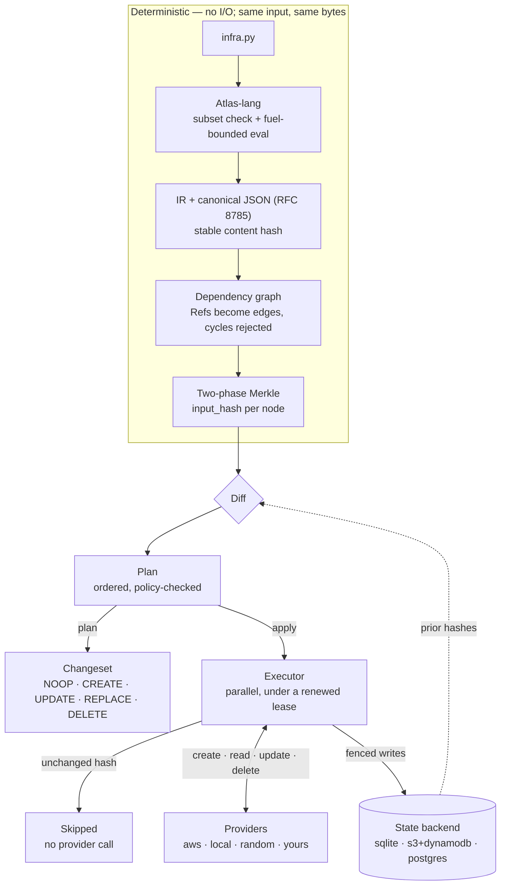

# Atlantide

**Typed, deterministic Infrastructure-as-Code for Python.**

Write infrastructure in real Python — type-checked by your IDE and `mypy`, not a
templating language — and get the guarantees a config language exists to provide:
the same config always produces the same plan, and the engine can prove it.

Atlantide rests on three ideas:

- **Enforced determinism.** Configs are plain Python, but executed by *Atlas-lang*:
  a bounded interpreter with no clock, no randomness, no environment, no network.
  Two runs of the same config produce a byte-identical intermediate representation
  and a stable content hash. Not a convention — the interpreter cannot do otherwise.
- **Graph state with Merkle skip.** Resources form a dependency graph. A two-phase
  Merkle `input_hash` lets `apply` skip unchanged nodes with *zero* provider calls,
  and reconcile independent nodes in parallel.
- **Per-field mutability.** Every field is declared `mutable()`, `immutable()`, or
  `computed()`. Changing a mutable field is an in-place UPDATE; changing an
  immutable one is a REPLACE; computed fields never diff. What a change costs is
  visible in the type, before you run anything.

---

## Install

```bash
pip install atlantide          # or: uv add atlantide
```

Python ≥ 3.12.

```bash
atlantide init myproject       # scaffold a project that already compiles
cd myproject && atlantide plan
```

`init` writes an `atlantide.toml`, a starter config, and a `.gitignore` that keeps
the state database and the secrets keyfile out of git. The default template uses the
local provider, so it applies with no cloud credentials at all.

## A quick look

```python
from atlantide.core import Config, EnvSchema, Stack, output
from atlantide.policy import enforce
from atlantide.providers.aws import S3Bucket, SqsQueue

enforce("require-tags", keys=["env"])
enforce("deny-destroy-in-protected", stacks=["prod"])

class AppEnv(EnvSchema):
    versioning: bool = False

config = Config(
    AppEnv,
    envs={
        "dev":  {"region": "eu-north-1", "tags": {"env": "dev"}},
        "prod": {"region": "eu-north-1", "tags": {"env": "prod"}, "versioning": True},
    },
)

for env in config.envs():                       # env: AppEnv
    with Stack(env.name, config=env, name_prefix="atlantide"):
        assets = S3Bucket("assets", versioning=env.versioning)
        jobs = SqsQueue("jobs", fifo=True)
        output("assets_arn", assets.arn)
```

One `Config` holds every environment and what differs between them. Each variable
declares its type and, optionally, a default, so a missing or mistyped prod value
fails `atlantide validate` rather than the prod apply. `region`, `tags` and
`name_prefix` are well-known keys the `Stack` reads directly.

An `EnvSchema` is the one class Atlas-lang admits — annotated fields only, no
methods and no decorators, so it is still data. Declaring it makes the variables
ordinary attributes: your editor completes `env.versioning`, and
`env.versionning` is a type error. A schema can also be a mapping of `var()`
declarations (`Config(schema={"versioning": var(bool, default=False)},
envs=...)`) when the static side does not matter.

```bash
atlantide plan  infra.py               # preview, every environment
atlantide plan  infra.py --show-unchanged  # also list NOOP rows (folded to a count by default)
atlantide apply infra.py               # reconcile, in parallel
atlantide apply infra.py               # again: all NOOP, zero provider calls
atlantide apply infra.py --env prod    # prod only; dev is not diffed or touched
```

Reading another resource's output (`assets.arn`) returns a lazy `Ref`. That is what
wires the dependency edge — no explicit `depends_on`, no string addresses — and it
resolves to the real value at apply time.

### Infrastructure that already exists

Declare it as above, then bind it to what is already running rather than building a
second copy:

```bash
atlantide import                              # what is declared but not tracked
atlantide import prod:aws.S3Bucket:assets     # found by name
atlantide import prod:aws.Vpc:main vpc-0abc   # located by an id AWS assigned
atlantide plan                                # no changes
```

A resource whose live settings differ from what the config declares is *not*
imported — importing it would mean the next apply quietly changes it. `import` prints
what differs so the config can be reconciled first, or `--allow-drift` adopts it and
lets the next plan show the update. Nothing about `import` creates, changes or
deletes anything; the undo is `atlantide state rm`, which forgets a row and leaves
the resource alone.

## How it works

Every `plan` and `apply` runs one pipeline. Everything before the diff is pure and
deterministic; everything after it touches the world.


```mermaid
flowchart TB
    subgraph pure["Deterministic — no I/O; same input, same bytes"]
        direction LR
        cfg["infra.py"] --> lang["Atlas-lang<br/>subset check + fuel-bounded eval"]
        lang --> ir["IR + canonical JSON (RFC 8785)<br/>stable content hash"]
        ir --> dag["Dependency graph<br/>Refs become edges, cycles rejected"]
        dag --> merkle["Two-phase Merkle<br/>input_hash per node"]
    end

    merkle --> diff{"Diff"}
    store[("State backend<br/>sqlite · s3+dynamodb · postgres")] -.->|prior hashes| diff
    diff --> plan["Plan<br/>ordered, policy-checked"]

    plan -->|plan| changeset["Changeset<br/>NOOP · CREATE · UPDATE · REPLACE · DELETE"]
    plan -->|apply| exec["Executor<br/>parallel, under a renewed lease"]

    exec -->|unchanged hash| skip["Skipped<br/>no provider call"]
    exec <-->|create · read · update · delete| prov["Providers<br/>aws · local · random · yours"]
    exec -->|fenced writes| store
```

1. **Atlas-lang** validates the config against a Python subset — no `while`,
   `class`, dunder access, `eval`, or non-allowlisted imports — then evaluates it
   with a fuel budget and deterministic builtins only. The budget is a fixed bound
   (5,000,000 steps by default, roughly 100 per resource); a larger config raises
   it with `[lang] fuel = N` in `atlantide.toml` or `--fuel N`. It never changes
   what a config that fits in it produces.
2. **Lowering** turns evaluated resources, `Ref`s and `output()`s into an IR graph.
   `Ref`s become dependency edges.
3. **Canonicalization** serializes that IR to RFC 8785 JSON and hashes it. Two runs
   are byte-identical, which is what makes a `.atlas` artifact portable.
4. **Graph + Merkle**: cycles are rejected (Tarjan), then each node gets a
   two-phase `input_hash` in topological order — so a change to one resource
   propagates to everything downstream of it, and nothing else.
5. **Diff** compares desired hashes against prior state, yielding a per-node action.
   Per-field mutability is what decides UPDATE versus REPLACE.
6. **Plan** orders the actions (creates and updates topologically, deletes in
   reverse; a REPLACE is destroy-before-create), then policy bindings run against
   the changeset — a mandatory violation blocks `apply` before anything happens.
7. **Apply** takes a lease over the reachable graph, reconciles independent nodes
   in parallel, skips Merkle-unchanged nodes entirely, and persists incrementally.
   On failure it rolls back completed nodes as a saga.

The pure half is why `plan` needs no credentials, why `validate` runs in a
pre-commit hook, and why the same compiled artifact can be promoted from staging
to production without re-executing the config.

## Main features

**Determinism**
- No clock, environment, or network in config — the interpreter has no such builtins.
- Content-hashed IR; `build` emits a portable `.atlas` artifact with provider
  versions pinned, `verify` re-checks it.
- Determinism is over *(config, inputs, selected environments)* — only inputs the
  config actually **read**.

**Plans**
- Unchanged nodes cost zero provider calls.
- `apply` re-diffs under the lock and **refuses** if the executed set differs from
  the approved one (`--allow-plan-drift` opts out).
- `refresh` reports which fields it actually checked; an unchecked field is never
  claimed in sync.
- A **known-after-apply REPLACE** — an `immutable()` field wired to an upstream's
  computed output, like a CloudFront distribution's `origin_domain` on its bucket's
  `regional_domain_name` — is confirmed at apply, once the upstream has applied:
  if no immutable value actually moved it runs as an update (or as nothing), so
  retagging a bucket does not rebuild the distribution in front of it. The apply
  report lists such nodes under `downgraded`.
- **`prevent_destroy` takes effect in the plan that sets it**, as in Terraform: for
  a resource the config declares the config's flag decides, so adding it already
  refuses a replace in the same plan and removing it already permits one; for a
  resource the config drops (a delete, `destroy`) the flag recorded in state
  decides. A protect-only edit is a *state-only* change: `plan` shows it,
  `--detailed-exitcode` counts it, and `apply` records it without calling the
  provider. A protected resource behind a known-after-apply replace is judged at
  apply (the plan warns), and refused there if the replace is confirmed.
- A resource the provider cannot find is reported but **kept**.

**State**
- Backends: sqlite (default), memory, S3 + DynamoDB, Postgres.
- Per-node leases, renewed for as long as a run lives.
- **Fenced writes** — the store refuses a write (stack outputs included) from a
  lease that is no longer the holder. On S3 the fence is checked by the write's
  conditional commit on the node's DynamoDB head, on Postgres inside the write's
  transaction with the lock rows held `FOR UPDATE`, so a takeover can never race
  a late write.
- **S3 state is a journal**: each write is one small S3 object plus one
  conditional DynamoDB update, so writes cost O(1) whatever the size of the
  graph and up to `[state].write_concurrency` (default 16, capped by
  `--parallelism`) run at once. The journal is folded into a snapshot after every
  locked run, in the background every 1000 writes, and on `state compact`;
  `state fsck` cross-checks it. Readers need `s3:ListBucket` and
  `dynamodb:BatchGetItem`; `state check` probes both and warns when the journal
  prefix has no lifecycle rule or the heads table has no point-in-time recovery.
- S3 lock rows and heads are namespaced per state object, so projects can share
  a DynamoDB lock table (heads can go in their own `[state].journal_table`).
  `[state].lock_skew_margin` (default 30s) is how long past expiry a lapsed lease
  waits before another run takes it: on S3 it bounds the tolerated clock skew
  between hosts; Postgres judges expiry by the database server's clock, so client
  skew does not matter there at all.
- Versioned formats, refuse-older and refuse-newer. `state backup` / `restore`;
  `state migrate` carries state between backends and formats.
- Ctrl-C rolls back rather than abandoning the run mid-graph.

**Secrets**
- `atlantide.secret("name")` is a *handle*; plaintext resolves in memory at apply.
- Sensitive outputs sealed at rest; logs and audit records redact by construction.
- Value stores: AES-GCM keyfile, environment, SSM Parameter Store.
- The `env` provider is deny-by-default: it reads only variables matching
  `[secrets.env] allow = ["APP_*", "DB_PASSWORD"]` (case-sensitive globs) in
  `atlantide.toml`, so a config or third-party component cannot read arbitrary
  process env such as `AWS_SECRET_ACCESS_KEY`.

**Escape hatches**
- `--target` narrows to a resource and its closure, `--replace` forces a recreate —
  both printed in the plan.
- `--env` narrows to one environment of the config's `Config`. An unselected
  environment is out of scope, not undeclared: its state is never planned for
  deletion, and the plan says which environments it left out.
- A targeted apply leaves unselected state byte-identical.
- `state rm` forgets a row without touching the provider; `state unlock` breaks a
  dead run's lease.

**CI**
- `--json`: stdout is exactly one JSON document, success or failure.
- `--detailed-exitcode`: 0 no changes, 2 changes pending, 1 error.
- `--audit-log` appends every run to JSONL, no-ops included.
- Prompts are refused without a terminal; pass `--confirm/-y`.
- `--debug` (or `ATLANTIDE_DEBUG=1`, handy in a CI job's env) prints the full
  traceback and cause chain on error; `--log-level debug` adds logs at the I/O
  boundaries (ids, counts and durations, never values).

**Extensibility**
- Providers are ordinary Python packages discovered by entry point — the built-ins
  included. A plugin's entry point, name, resource types and provider must share
  one name, so no plugin can handle another provider's resources; one that does
  not is refused and the run aborts (see `atlantide/providers/README.md`).
- Components (L2 constructs) publishable from a git repo, pinned to a commit and
  content hash, vendored locally.

## Testing components

`atlantide.testing` compiles a component and plans runs over it the way
`atlantide plan` does, calling the same lowering, Merkle hashing, diff and
`prevent_destroy` guard. It applies nothing, so a component's tests need no cloud
account and no mocks:

```python
from returns.pipeline import is_successful
from atlantide.testing import Action, Compiled

def compiled(**kwargs) -> Compiled:
    return Compiled.of(lambda: RemoteState("tfstate", **kwargs), region="eu-north-1")

run = compiled(versioning=False).against(compiled())  # a re-run over the prior apply
assert run.actions["tfstate-bucket"] is Action.UPDATE
assert run["tfstate-bucket"].changed_fields == ("versioning",)
assert not is_successful(Compiled.empty().against(compiled(protect=True)).approve())
```

Field mutability comes from the installed provider plugins, as in a run.
`plan.committed()` is the state an apply of that plan would leave, and
`against(plan)` plans the next run over it. See `atlantide/testing/README.md` for
the full API.

## Code map

A package never imports one listed above it, and `lang`, `state`, `policy`,
`providers` and `secrets` never import each other (both enforced by
`lint-imports`, along with `components` importing only `core` and `util`, and
nothing importing `testing`).

```
atlantide/
  testing/      the public test API for component authors: Compiled, Plan (compile + plan, no apply)
  cli/          Typer app: app.py (root options), wiring.py, target.py, config_source.py,
                project.py (atlantide.toml)
    commands/   one module or sub-package per command group (run, validate, state/, init/, ...)
    views/      Rich tables and --json documents (plan, report, drift, imports, state); no command logic
  engine/       compile -> plan -> apply: the Engine façade, compiler, selection, planner (with
                secret_audit and policy_eval), runs, locking
  reconcile/    diff, built from changes (the Change/ChangeSet model), classify (the per-node rules),
                upstream and applied (did an upstream value move) and ordering (replace order);
                guards (prevent_destroy), refresh, adopt (import), aliases, resolve, writer (state writer
                threads), env (what a run executes against), progress, report, state_ir (state read
                back as a graph)
    executor/   applying a changeset: run (phases), context, confirm, replace, deletes,
                records (state rows), saga (rollback), outputs
  lang/         Atlas-lang: builtins, surface (the import-surface audit)
    validate/   the static subset check; imports.py is the import allow-list
    interp/     the fuel-bounded interpreter (scope, evaluator, statements, expressions, binding)
  state/        model, leases, fencing, the StateBackend ABC, codec, factory, memory
    sql/        sqlite (default), postgres, schema (the column spec both dialects share), DSN helpers
    s3/         S3 snapshot + journal, DynamoDB heads and leases
  policy/  providers/  secrets/   policy bindings; aws/local/random providers; secret stores (base.py: SecretsProvider)
  graph/        dependency graph, topological order, --target selection
  ir/           lowering, RFC 8785 canonical JSON, Merkle hashes, .atlas artifacts
  components/   vendored L2 components: fetch, lock file, sources
  util/         engine plumbing: AWS client config, owner-only files, project-file lookup, errors, JSON
  core/         resources, fields, markers, errors, config types (_config_types.py): the public config API
```

`util` is deliberately **outside** the config import surface: config may import
only from `atlantide.core`, `.policy`, `.providers` and `.components` (minus
their IO-reaching modules, see `lang/validate/imports.py`), so shared plumbing that
touches the filesystem or AWS belongs in `util`, never under those prefixes.

`tests/` mirrors this layout, with shared builders in `tests/support/`. The AWS
provider suite is split one module per service under `tests/providers/aws/`
(`test_s3.py`, `test_ec2_networking.py`, `test_iam.py`, ...), all on moto.

<!-- docs:start -->
## Documentation

**<https://atlantide-org.github.io/>**

- [CLI](https://atlantide-org.github.io/reference/cli/) — every command, targeting, exit codes
- [Configuration](https://atlantide-org.github.io/reference/configuration/) — `atlantide.toml`, inputs, profiles
- [Remote state](https://atlantide-org.github.io/reference/remote-state/) — S3 and Postgres backends, concurrency, secrets
- [Authoring](https://atlantide-org.github.io/reference/authoring/) — output combinators, explicit ordering, renames
- [Providers](https://atlantide-org.github.io/reference/providers/) — what ships, and writing your own
- [Components](https://atlantide-org.github.io/reference/components/) — L2 constructs, publishing, consuming
- [API reference](https://atlantide-org.github.io/api/) — `atlantide.core` and `atlantide.engine`
- [Architecture](https://atlantide-org.github.io/architecture/) — what each package is for

Runnable examples: [`examples/aws/`](examples/aws/) and [`examples/components/`](examples/components/).
<!-- docs:end -->
